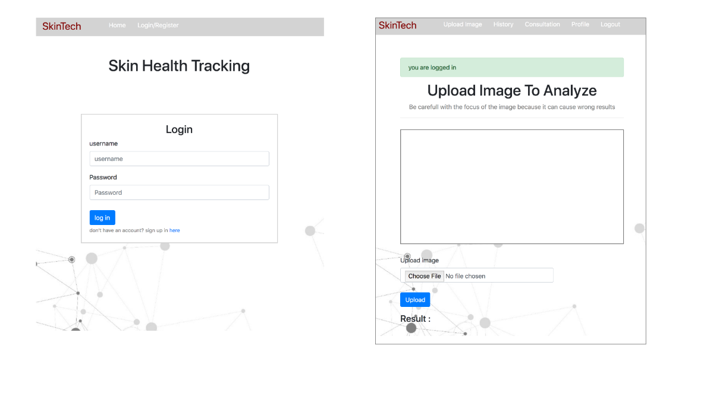

SkinTech
==========

SKinTech is a skin cancer detector using machine learning to determine whether the skin image is considered as malignant or benign cancer

Future improvement including:

- Add chat for doctor consultation 

Dependencies
--------
- see requirement.txt

Installation
------------

Clone this repository, and run:

    pip3 install -r requirements.txt

## Run code

before run, you must create superuser to access the database:

      python manage.py createsuperuser

In the project directory, you can run:

### `python manage.py runserver`

Runs the app in the development mode in localhost:8000

to access the database: localhost:8000/admin

